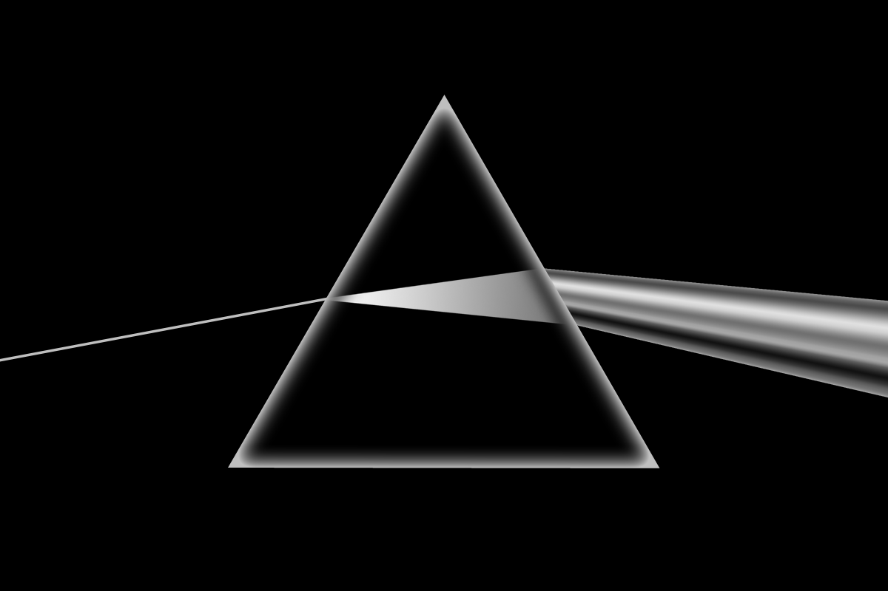
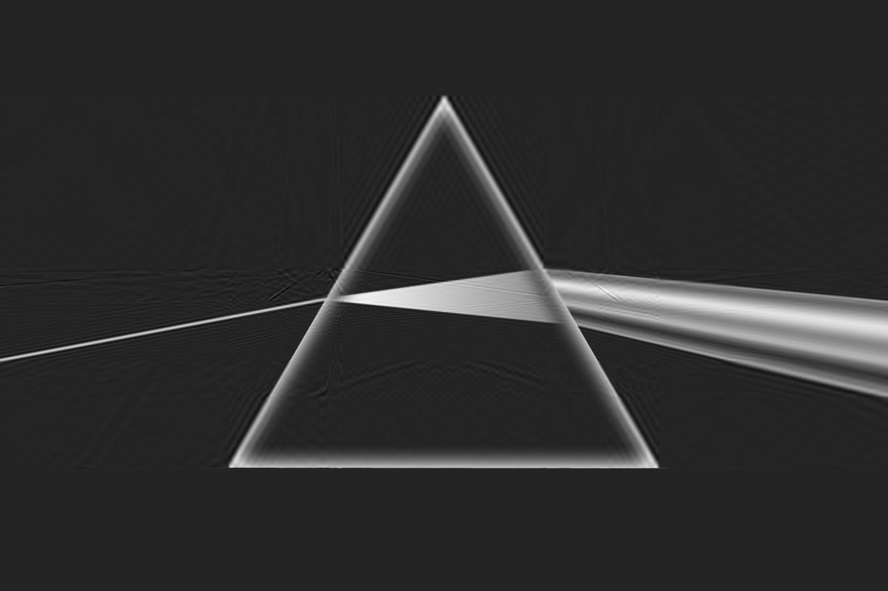
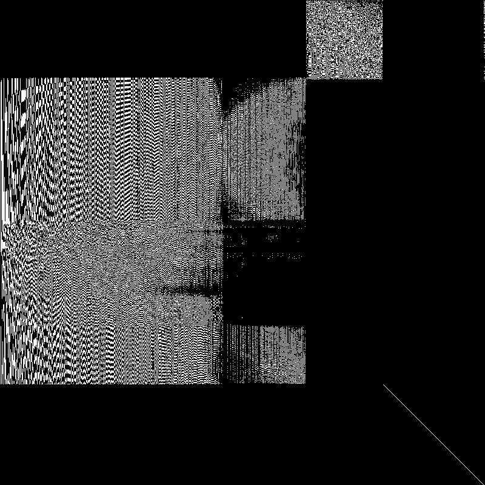
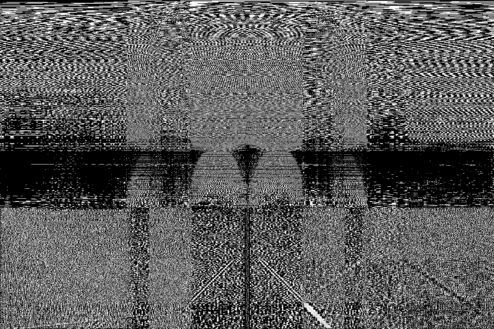

# ma_ipz_lab_work
Lab work 3 for MA IPZ

## Structure
- [Implementation file](utils.py)

- [Main file](main.py)

### Here we can compress images with desired density f.e. 75%:

|                  Original image                   |                Compressed image                 |
|:-------------------------------------------------:|:-----------------------------------------------:|
|  |  |

|                     Matrix U                      |                     Matrix Sigma                     |                     Matrix VT                     |
|:-------------------------------------------------:|:----------------------------------------------------:|:-------------------------------------------------:|
|  |  |  |